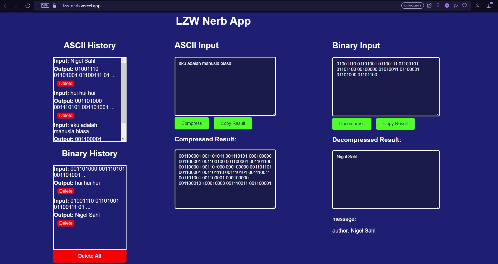

# LZW_Nerb
Lempel-Ziv-Welch algorithm web application  

## Table of Contents
* [General Info](#general-information)
* [Technologies Used](#technologies-used)
* [Features](#features)
* [Screenshots](#screenshots)
* [How to Run](#how-to-run)
* [How to Run Locally](#how-to-run-locally)
* [Explanation of Project](#explanation-of-project)
* [Project Status](#project-status)
* [Room for Improvement](#room-for-improvement)

## General Information
LZW Nerb is a web application that can be used to compress ASCII text into binary and decompress binary into ASCII text using LZW algorithm. LZW is Lemper-Ziv-Welch algorithm that is used to compress data. This web has a database for the history of compression and decompression. 

## Technologies Used
- ReactJS
- NodeJS
- ExpressJS
- MongoDB
- Vercel

## Features
List the ready features here:
- Input ASCII text and compress it into binary
- Input binary and decompress it into ASCII text
- Copy the result to clipboard
- See the history of compression and decompression
- See the detail of compression and decompression
- Delete the history of compression and decompression
- Delete all history of compression and decompression

## Screenshots

## How to Run
1. Open the link "https://lzw-nerb.vercel.app" in your browser.
2. The program is now ready to use. There are two main input boxes: ASCII Input and Binary Input.
3. To perform compression, enter the text in ASCII format in the ASCII Input box and click the "Compress" button.
4. To perform decompression, enter the text in binary format in the Binary Input box and click the "Decompress" button.
5. The compression and decompression results will be displayed at the bottom of the input boxes. There is a "Copy Result" button to copy the compression or decompression result to the clipboard.
6. On the left side, there is a history box that contains the history of performed compressions and decompressions. To view the details of a compression or decompression, click on one of the history entries, and the details will be displayed in the input and output boxes according to their type (ASCII or Binary).
7. To delete a history entry, click the "Delete" button on the corresponding entry. To delete all history entries, click the "Delete All" button.
8. There is a message box in the bottom right corner to provide program status updates.

## How to Run Locally
1. If you want to run the backend locally, open [App.js](./lzw_fe/src/App.js), uncoment the line 11 and comment the line 12 Open the terminal in the [LZW_BE](./LZW_BE) folder and enter the command `npm install` in the terminal. Then, follow the steps 1-8 in the section [How to Run](#how-to-run). 
2. If you want to run the frontend locally, you have to run the backend locally too. Then, Open the terminal in the [lzw_fe](./lzw_fe) folder and enter the command `npm install` in the terminal. Run the frontend using the command `yarn start`. Then, follow the steps 2-8 in the section [How to Run](#how-to-run).

## Explanation of Project
<!-- dokumentasi pengembangan khususnya penjelasan tahapan dari input - proses kompresi - output -->
1. Backend development:
    - Initialize the backend using npm init, and install the dependencies: express, mongoose, dotenv, cors, etc.
    - Create a main program in the backend that connect to all the other programs in the file [api](./LZW_BE/src/api.js)
    - Create a database using MongoDB Atlas: 
        - Create a cluster
        - Create a database user
        - Create a database
        - Create a collection
    - Create a configuration of the database in the backend in the file [database connection](./LZW_BE/config/dbConnection.js)
    - Create a model of the database in the backend in the file [model](./LZW_BE/models/Model.js), the model is for the database collection of history of compression and decompression
    - Create a controller of the database in the backend in the file [controller](./LZW_BE/controllers/LZW_Controller.js), the controllers that are used are getLZW, getLZWById, createLZW, deleteLZWById, deleteLZW, compressLZW, and decompressLZW. All of the controllers are used in the routes. 
    - Create a route of the database in the backend in the file [route](./LZW_BE/routes/LZW_Route.js), the routes that are used are:
        - GET /LZW is used to get all the history of compression and decompression
        - POST /LZW is used to add a history of compression and decompression
        - GET /LZW/:id is used to get a history of compression and decompression by id
        - DELETE /LZW/:id is used to delete a history of compression and decompression by id
        - DELETE /LZW is used to delete all the history of compression and decompression
        - POST /LZW/compress is used to compress the input text into binary
        - POST /LZW/decompress is used to decompress the input binary into text
    - Create a middleware of the database in the backend in the file [middleware](./LZW_BE/middleware/errorHandler.js), the middleware is used to handle the error in the backend
    - The main function of the backend is in the file [algorithm](./LZW_BE/src/algo.js), this main function is used to compress and decompress the input text using LZW algorithm. LZW algorithm is an algorithm use a dictionary to store the ascii binary representation and additional string. The algorithm is:

        Compression Algorithm:
        1. Start with an empty dictionary containing all single characters.
        2. Read the input text character by character.
        3. If the current character plus the previously read characters is in the dictionary, append the current character to the previously read characters and continue to the next character.
        4. If the current character plus the previously read characters is not in the dictionary, 
        add the the previously read characters to the output and add the current character plus the previously read characters to the dictionary.
        5. Repeat steps 3-4 until all characters in the input text have been processed.
        6. Add the last remaining characters to the output.
        7. Return the compressed output, which is a sequence of dictionary indices.

        Decompression Algorithm:
        1. Start with an empty dictionary containing all single characters.
        2. Read the input consisting of dictionary indices.
        3. Add character from the dictionary that corresponds to the first index of the input to the output. 
        4. Initialize a string with the character from step 3.
        5. Iterate the remaining indices one by one.
        6. If the current index is not in the dictionary, add an entry to the dictionary by concatenating the string from step 4 with its first character.
        7. Add the entry from the dictionary that corresponds to the current index to the output.
        8. Update the string by setting it to the entry from step 7.
        9. Repeat steps 5-8 until all indices have been processed.
        10. Return the decompressed output, which is the reconstructed original text.

    - The functions to compress and decompress are in the file [ascii to binary](./LZW_BE/src/asciiToBinary.js)

2. Frontend Development
    - Initialize the frontend using npx create-react-app, and install the dependencies
    - Edit App.js to create the main program of the frontend
    - Edit App.css to create the style of the frontend. There are several classes that are used to style the frontend. 
    - In the App.js, create several functions to handle the input and output of the program, the functions are:
        - fetchData: to get the data from the backend
        - addHistory: to add the history of compression and decompression to the database
        - useEffect: to get the data from the backend when the page is loaded
        - deleteHistory: to delete a history of compression and decompression from the database
        - deleteAllHistories: to delete all histories of compression and decompression from the database
        - copyToClipboard: to copy the compression or decompression result to the clipboard
        - compressAscii: to compress the input text into binary (ascii to binary, using LZW algorithm in the backend)
        - decompressBinary: to decompress the input binary into text (binary to ascii, using LZW algorithm in the backend)
        - handling for input change
        - etc.
    - Some of the functions above are getting the data from the backend and sending the data to the backend. compressAscii and decompressBinary are using fetch to send the data ASCII text or binary to the backend and get the result from the backend.

## Project Status
Project is: _complete_ 

## Room for Improvement

Room for improvement:
- speed up the algorithm
- improve user interface and user experience

